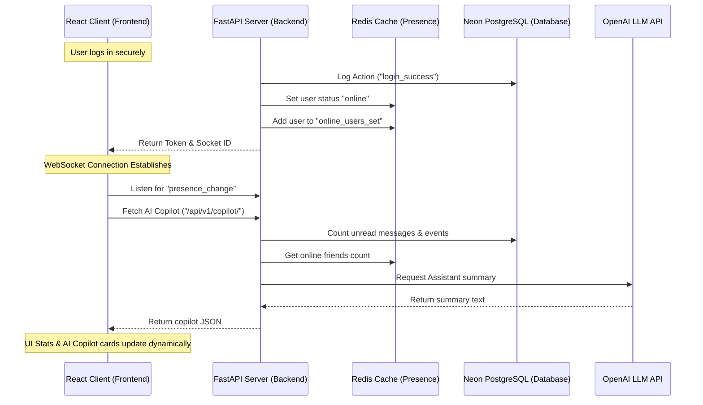

# 🌌 CONNECT-SON: Premium Digital Memory OS

CONNECT-SON is a world-class premium SaaS and social platform designed as a personal memory operating system. It features end-to-end encryption, real-time collaboration hubs, security guards, relationship analytics, and an integrated AI assistant.

This README highlights the technical stack, the system architecture, the features implemented, and the engineering decisions behind them.

---

## 🛠️ Tech Stack & Engineering Rationale

### Backend (Python Core)
- **FastAPI**: Chosen for its high performance (comparable to Go/Node.js), automated OpenAPI documentation generation, and native support for asynchronous requests (`async/await`).
- **SQLAlchemy (ORM)**: Translates schema designs into efficient SQL statements. CONNECT-SON runs with a serverless PostgreSQL database (hosted via **Neon**) for storage and DDL transactions.
- **Redis (Upstash)**: Provides instant, low-latency caching. CONNECT-SON uses Redis sets to track active user presences (`online_users_set`) and cache authentication statuses.
- **Socket.IO**: Powers real-time bi-directional communication. Enables live presence change broadcasts and instant notification events.
- **OpenAI API**: Generates personalized natural language assistant summary greetings for users based on database stats.

### Frontend (React Core)
- **Vite & TypeScript**: Chosen for sub-second hot module replacement (HMR), rapid build tooling, and static compile-time type safety.
- **Framer Motion**: Enables smooth micro-animations, transitions, and hover-triggered glass overlays.
- **HTML Canvas API**: Drives the responsive background interactive particle constellation on the dashboard and the full physics sandbox on the login/register screens.
- **Vanilla CSS & CSS Variables**: Provides clean, harmonized, HSL-tailored colors, Apple-style glassmorphism styling, and custom themes with maximum layout control.

---

## 🛸 Core Features Implemented

### 1. Interactive Constellation Background (Dashboard)
- A custom canvas network running in the background.
- When the mouse hovers over the screen, particles within proximity dynamically brighten to 85% opacity, expand, and connect with other nodes in all directions with bright, glowing cyan lines to form a responsive neural web.

### 2. Full-Physics Interactive Sandbox (Login & Register Pages)
- A custom high-performance HTML5 Canvas physics engine containing multiple layers of animations:
  - **🌧️ Rain Drops & Splashes**: Linear glowing rain streaks falling vertically. When a raindrop hits either the screen's bottom boundary or the top of the central glass card, it triggers a mini-splash animation consisting of gravity-affected, fading droplets.
  - **🏀 Bouncing Neon Balls**: Vibrant glowing gradient balls falling and bouncing elastically off the bottom screen edge, side walls, and the boundaries of the central glass card.
  - **🧬 Small Brand Logos & Icons**: Small rotating logo textures (`/logo.png`) and system emojis (representing chat, lock, status, gaming, etc.) falling and interacting with the environment.
  - **🖱️ Mouse Repulsion**: Moving the mouse over the screen exerts an elastic repulsion force that scatters and pushes the bouncing particles away.
  - **📦 Dynamic AABB Card Collisions**: Real-time Axis-Aligned Bounding Box (AABB) intersection checking dynamically measures the layout coordinates of the login/register glass card. Bouncing particles slide off, land on, and collide with the card's boundary as physical obstacles.

### 3. Connect AI Copilot (🤖 Assistant Engine)
- Positioned in the right sidebar. Features an assistant summary bubble populated by either an LLM (using the configured OpenAI key) or a smart, local time-based fallback greeting.
- Automatically calculates:
  - **📩 Unread messages** (via database message status records).
  - **🎮 Online friends** (computed via Redis presence indicators).
  - **📅 Upcoming events** scheduled within 24 hours.
  - **🔒 Security Health Score** (rule-based completion score).
- Recommends quick actions (e.g. 2FA setup, E2EE key sync, or profile completion check).

### 3. Dynamic Real-Time Stats Grid Cards
- Positioned below the stories section. Maps all four cards dynamically:
  - **Connections**: Real-time friendship database counts.
  - **Encrypted Chats**: Total messages sent and received by the user.
  - **Broadcasts**: Count of active expiring stories.
  - **Security Score**: Live cryptographic audit calculation (2FA, E2EE sync, verification).
- Supports **Demo Mode**: Toggling Demo Mode ON injects high-fidelity mockup metrics (128 connections, 1,274 messages, etc.) for presentation purposes, while toggling Demo Mode OFF queries real-time database records.

### 4. Real-Time Recent Activity Feed
- Reads dynamically from the database `AuditLog` chain.
- Translates system events (such as secure logins, profile modifications, or E2EE activation) into human-readable logs (e.g. *"Priyanshu signed in securely"*, *"Amit completed security setup"*).
- Calculates elapsed relative times dynamically (e.g. *"Just now"*, *"2m ago"*, *"1h ago"*).

### 5. Command Palette (`Ctrl + K` / Universal Search Bar)
- Pressing `Ctrl + K` or clicking the search field triggers a premium frosted glass command overlay.
- Lists quick shortcuts for running cybersecurity audits, searching active friends, creating stories, and navigating to notes or calendar hubs.
- Embeds a mock **Cybersecurity Audit Scan** inside the command palette with animated progress loading percentages.

### 6. Story Creator Category Upgrades
- Extends the upload panel to support category tabs: `Photo/Video`, `Voice Story`, `Quick Thought`, and `Mood Status`.
- Each tab features unique UI pre-rendering layouts (e.g. active audio waves for voice, gradient canvas previews for thoughts, emoji selection rings for moods).

---

## 🛰️ Architecture & Real-Time Flow



---

## 🚀 Running CONNECT-SON Locally

### 1. Backend Setup
1. Navigate to the `backend` directory:
   ```bash
   cd backend
   ```
2. Install dependencies:
   ```bash
   pip install -r requirements.txt
   ```
3. Copy environment variables to `.env` and fill out credentials (including `OPENAI_API_KEY` for AI assistant capabilities):
   ```bash
   # Add your OpenAI Key:
   OPENAI_API_KEY=your_key_here
   ```
4. Start the FastAPI development server:
   ```bash
   python -m uvicorn app.main:app --host 127.0.0.1 --port 8000
   ```

### 2. Frontend Setup
1. Navigate to the `frontend` directory:
   ```bash
   cd ../frontend
   ```
2. Install packages:
   ```bash
   npm install
   ```
3. Start the Vite development hot reload server:
   ```bash
   npm run dev
   ```
4. Build for production:
   ```bash
   npm run build
   ```
